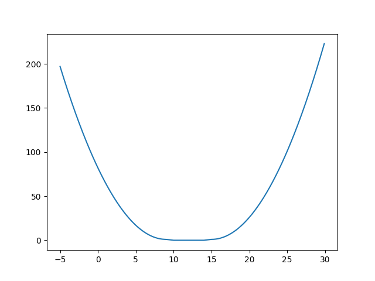

# Алгоритм помещения выпуклых многоугольников в выпуклый контур
Подход с перебором всех возможных позиций/поворотов не является очень интеллектулаьным, поэтому была предпринята попытка пойти немного другим путём.
## Упрощение задачи
Для начала стоит упросить задачу. Возьмём 1 выпуклый многоугольник и поместим его в выпуклый контур. Так как оба рассматриваемых объекта выпуклые, возникает желание воспользоваться градиентными методами оптимизации для минимизации некоторой функции, которую следует придумать. В идеале такие методы смогут за достаточно малое число итераций ответить на вопрос "Можно ли уместить, и если да то как".
## Функционал
$f1(x, y, \theta) = dist(object(x, y, \theta), contour)^2 + area(substract(object(x, y, \theta), contour))$

Где

$x$ - перемещение по оси X

$y$ - перемещение по оси Y

$\theta$ - поворот

$object(x, y, \theta)$ - множество точек объекта, после переноса и поворота

$contour$ - множество точек контура

$dist(A,B)$ - расстояние между двумя множествами A и B

$area(A)$ - площадь множества A

$substract(A, B)$ - разность множеств A и B

Данный функционал будет выпуклым как сумма двух выпуклых функционалов.
Для наглядности привожу график этого функционала в 1-мерном случае (Задача о помещении отрезка в отрезок)

Как можно заметить, первое слагаемое "доведёт" многоугольник до пересечения с контуром, а второе "уложит" многоугольник в контур

## О расположении множества многоугольников
Для укладки нескольких объектов одновременно, используется функционал 

$$f2(x_1, y_1, \theta_1, x_2, y_2, ...) = \sum_{i=1}^m f1(x_i, y_i, \theta_i) +  \sum_{i,j=1}^m area(intersect(object_i(x_i, y_i, \theta_i), object_j(x_j, y_j, \theta_j)))$$

Можно заметить, что функционал $area(intersect(object_i(x_i, y_i, \theta_i), object_j(x_j, y_j, \theta_j)))$ является вогнутным. А значит $f2$ уже не является выпуклым. Если $f2$ не выпуклый, это значит что наша функция может иметь несколько локальных минимумов, но данная ситуация на данный момент не обрабатывается. Несмотря на это, для всего набора тестовых данных алгоритм выдаёт правильный ответ.

Однако именно обработку вышеупомянутых ситуаций стоит рассмотреть как направление для дальнейших улучшений. Как возможные варианты предлагаются следующие идеи:
  - Можно попробовать перебрать различные стартовые расположения многоугольников, но это даст достаточно громоздкий перебор. Примерная оценка сложности O(x^(3\*n)), где x - число возможных состояний по каждой из осей(перенос по X, перенос по Y, поворот), а n - число объектов.
  - Чуть менее громоздкий перебор - расположить объекты по кругу, вокруг многоугольника. Тогда можно перебрать лишь все перестановки объектов. Примерная оценка сложности O(n!), где n - число объектов.
  - Можно попробовать укладывать многоугольники по очереди, каждый раз отрезая от контура зону с многоугольником, чтобы новый контур оставался выпуклым.
  - Можно проверять укладку сначала объектов по одному, затем по 2 и т.д., сохраняя предыдущие позиции объектов как новые стартовые позиции для градиентного метода.

## Замечания о реализации
Для выполнения процесса градиентного спуска использовался модуль [scipy.optimize.minimize](https://docs.scipy.org/doc/scipy/reference/generated/scipy.optimize.minimize.html). Из всех методов, которые поддерживает данная библиотека, используются 
- [Nelder-Mead](https://docs.scipy.org/doc/scipy/reference/optimize.minimize-neldermead.html#optimize-minimize-neldermead)
- [BFGS](https://docs.scipy.org/doc/scipy/reference/optimize.minimize-bfgs.html#optimize-minimize-bfgs)

На практике, бывали ситуации когда один из методов выдавал неправильную точку минимума, несмотря на то что функция была выпуклой. Поэтому, в случае если один из методов выдает точку, в которой значение функционала больше 0, предпренимается попытка использовать второй метод. Если же и второй метод выдаёт точку, в которой значение функционала больше 0, то возвращается False. Иначе возвращается True.

## Возможное практическое применения
- Предположим что имеется некий текстильный завод, производящий одежду. Каждый состоит из "кусочков" различной формы, которые необходимо потом сшить вместе. Очевидно что имеется желание уменьшить "обрезки". Если добавить итерирование по имеющимся размерам полотен ткани, то приведённый выше алгоритм сможет для набора кусочков ткани предложить их размещение на полотне, что можно использовать как "возможную подсказку", для человека, который ответственнен за эту работу.
- В программах для 3d моделирования объектов есть понятие UVMapping - соответствие некоторых наборов полигонов текстуре на плоскости. Данные наборы полигонов требуется размещать максимально плотно и на минимально возможное число текстур, чтобы уменьшить неиспользуемое в текстурах место и также уменьшить число используемых текстур. Добавив итерацию по возможным размерам текстур, можно использовать вышеприведённый алгоритм как возможное решение. 
