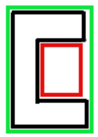
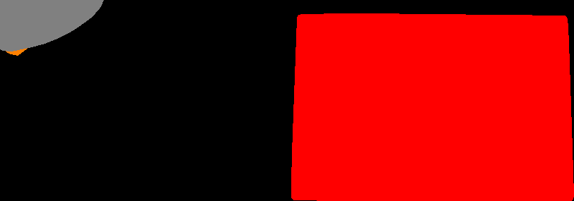

# intelligent-placer
Лабораторная работа по написанию Intelligent Placer-а, который по поданной на вход фотографии нескольких предметов на белой горизонтальной поверхности и многоугольнику понимает, можно ли расположить одновременно все эти предметы на плоскости так, чтобы они влезли в этот многоугольник.
# Постановка задачи
### Общие
- Программа получает на вход путь до изображения со всеми объектами и нарисованным на листе многоугольником
- Программа должна выдать ответ хотя бы за 15 минут
- Ответом может быть либо True либо False
- Программа отвечает True если можно уложить объекты в многоугольник
- Программа отвечает True если объектов на изображении нет, а многоугольник есть
- Программа отвечает False если нельзя уложить объекты в многоугольник
- Программа отвечает False если объекты на изображении есть, а многоугольника нет
- Программа отвечает False если многоугольник не является выпуклым
- Ответ выводится в стандартный поток вывода

### Ограничения по задаче
- Многоугольник должен быть замкнут 
- Многоугольник должен быть выпуклым
- Один объект должен присутствовать на фото только один раз
- Программа расценивает любые снятые объекты как абсолютно твёрдые тела
- Дыры внутри объектов не учитываются при работе программы 

### Содержание фотографий
- Объекты и многоугольник должны быть размещены на белой поверхности
- Объекты рассматриваются только из тренировочного набора данных(изображения которых приведены в директории images) 
- Объекты не должны пересекаться друг с другом
- Объекты не должны пересекаться с многоугольником
- Объекты и многоугольник должны целиком помещаться на фото
- Объекты должны распологаться вне многоугольника
- Многоугольник задаётся черным маркером на белом листе бумаги.
- Тени от объектов будут рассмотрены как часть этих объектов.

### Фотометрические
- Фотографии должны быть в формате, доступном для прочтения функцией imread из OpenCV. Список форматов приведён по [ссылке](https://docs.opencv.org/3.4/d4/da8/group__imgcodecs.html#ga288b8b3da0892bd651fce07b3bbd3a56)
- Угол между направлением камеры и перпендикуляром к поверхности должен быть не более *15&deg;* (отсутствие перспективных преобразований)
- Освещение и цвета объектов должны быть подобраны так, чтобы они были легко отличимы от поверхности
- Размер фотографии в пикселях должен быть достаточно большим, чтобы на них были отличимы объекты, многоугольник, фон.
- Размер фотографии в пикселях должен не превышать 8400×3600 пикселей (что соответсвует стандарту [8k](https://ru.wikipedia.org/wiki/8K_(%D1%80%D0%B0%D0%B7%D1%80%D0%B5%D1%88%D0%B5%D0%BD%D0%B8%D0%B5))).

# План решения задачи
Общая схема алгоритма представляется следующим образом
1) Найти на изображении многоугольник
  - Применить фильтр Канни. В результате найдутся 4 вложенных многоугольника. Далее идёт проверка цветов 2х точек. Первая - находится между двумя внешними контурами - цвет границы многоугольника. Вторая - центр масс всех 4-х многоугольников - цвет фона. После этого проверяется выпуклость.
2) Найти на изображении все объекты
  - Произвести локальную бинаризацию для того чтобы избавиться от засветов на изображении. После этого при помощи cv2.findContours найти предполагаемые контуры объектов. Исключить контуры которые слишком маленькие или слишком большие. А также контуры которые пересекаются с многоугольником. И построить выпуклые оболочки для получившихся объектов.
4) Проверить тривиальные случаи когда алгоритм работать не будет (На данный момент сравнение сумм площадей объектов и площади многоугольника)
5) Решать задачу о помещении выпуклых многоугольников в другой выпуклый многоугольник
  [Текущий вариант](Algorithm.md)

Как улучшение можно рассмотреть идею предложенную @lyphrowny.
Предложение было добавить этап 4.5), в котором попытаться уложить внутрь выпуклых оболочек больших объектов выпуклые оболочки объектов поменьше. Пример:

Тут зелёным обозначена выпуклая оболочка чёрного объекта и показано что красный объект можно вложить в свободное пространство.
Для того чтобы это сделать, можно построить разность между выпуклой оболочкой и контуром объекта. Для получившегося множества нужно найти его компоненты связности и для каждого из них построить максимальную по площади выпуклую оболочку лежащую внутри этого контура. Тогда можно воспользоваться алгоритмом из 5) и проверить, можно ли уложить малый объект в это пространство.
Добавление такой оптимизации уменьшит число объектов которое нужно укладывать, а значит повысит скорость работы. Дополнительно, это частично решит проблему укладки невыпуклых многоугольников.
  
# Изображения использованных объектов
[Нажмите чтобы перейти](images)

# Тесты
[Нажмите чтобы перейти](test_cases)

# Метрики качества

Все тесты из директории [test_cases](test_cases) проходят успешно. Как визуализацию работы алгоритма, можно посмотреть файл [examples.ipynb](examples.ipynb). 
Помимо этого в директории [gifs](gifs) лежат изображения \*.gif в которых также представлена работа алгоритма. Пример GIF изображения
 
