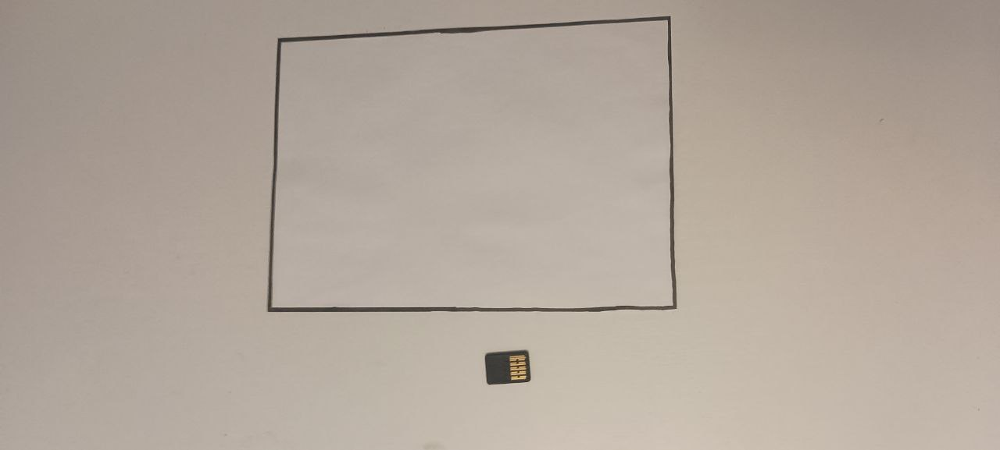
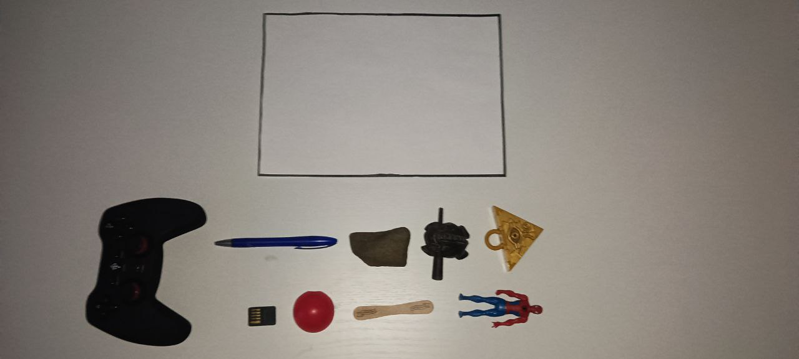
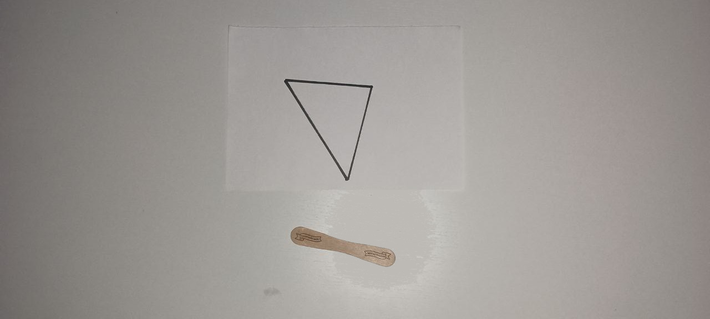
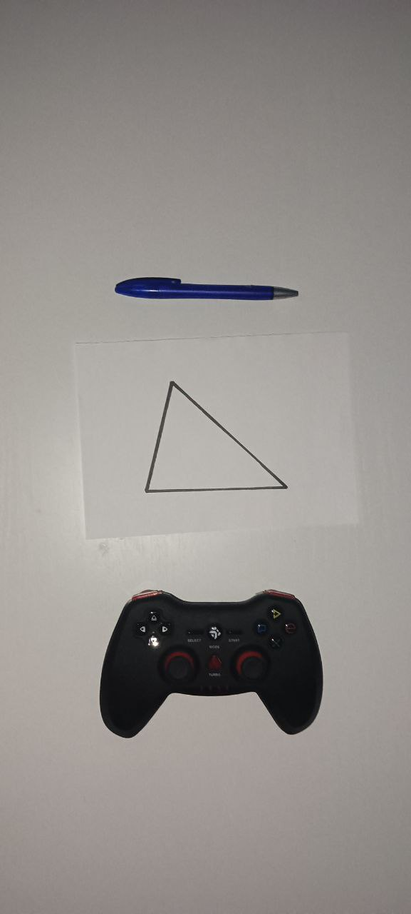
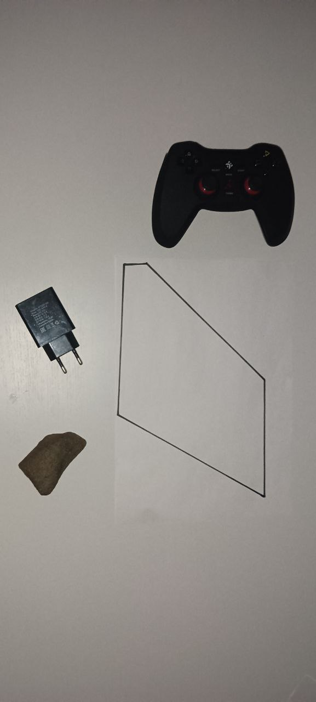
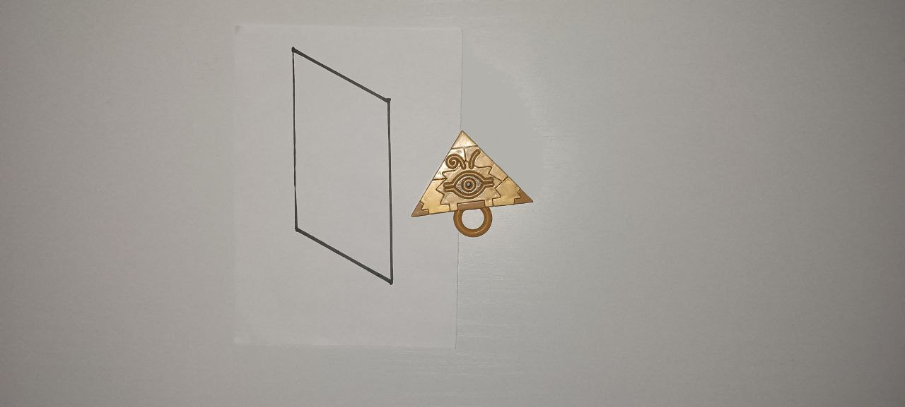
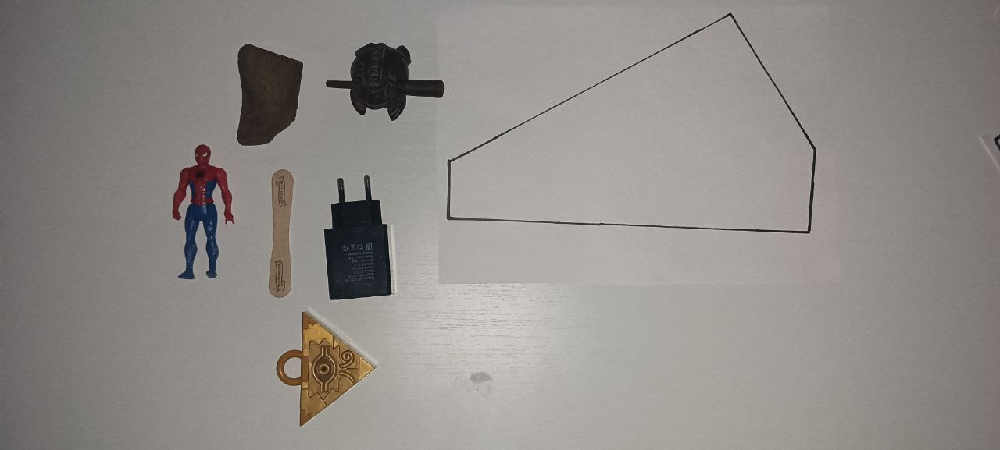
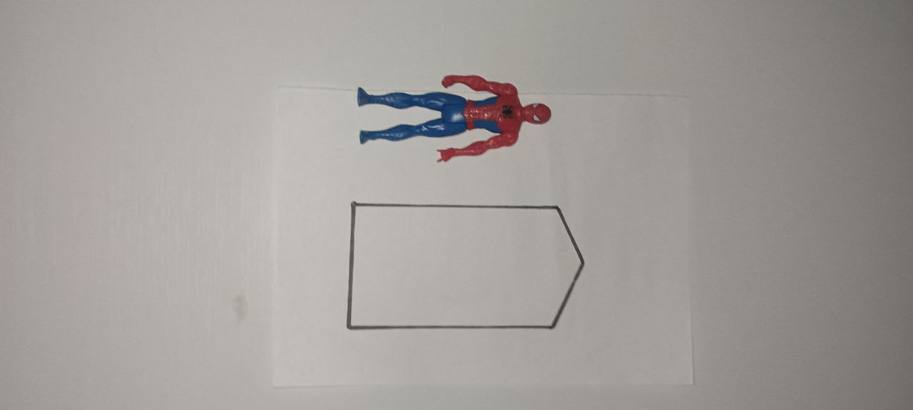
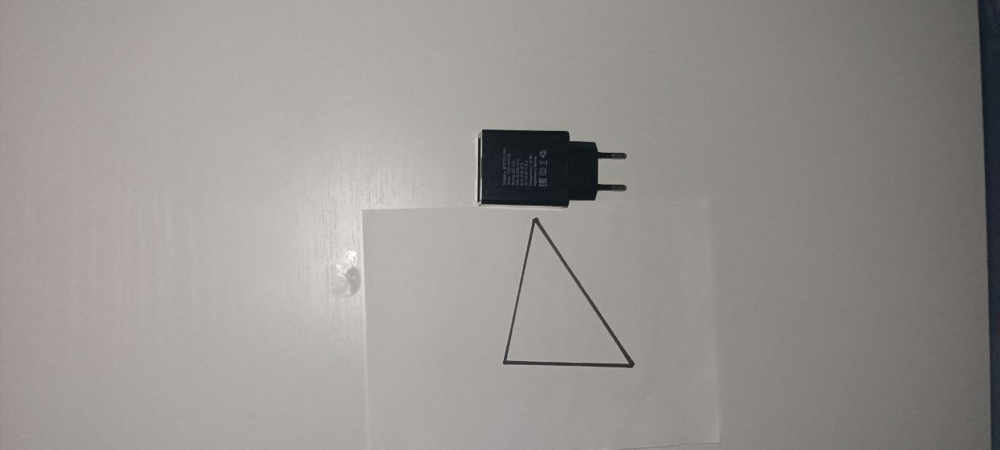

# Тестовые данные
## Репрезентативные тесты
0) Sanity test
Проверка на то что 1 маленький объект может поместиться в большой многоугольник

Ответ: True

1) Full test
Проверка на то что все имеющиеся объекты могут уложиться в наибольший (по площади) многоугольник.

Ответ: True

2) Close Yes
Проверка на то что объект еле-еле но вмещается

Ответ: True

3) Close No
Проверка на то что объект уже не вмещается

Ответ: False

4) No Poly
Проверка поведения при отсутствии многоугольника

Ответ: False

5) No Object
Проверка поведения при отсутствии объектов

Ответ: True

6) Not Convex Poly
Проверка поведения при невыпуклом многоугольнике

Ответ: False

7) Yes + Yes = No
Проверка двух объектов, каждый по отдельности помещается, но вместе нет

Ответ: False

8) Yes + Yes = Yes
Проверка двух объектов, каждый по отдельности помещается, и вместе тоже

Ответ: True

9) Yes + No = No
Проверка двух объектов, один помещается, а другой нет

Ответ: False

10) No + No = No
Проверка двух объектов, оба не помещаются

Ответ: False

## Остальные тесты

Ответ: True

Ответ: True

Ответ: False

Ответ: False

Ответ: True

Ответ: True

Ответ: True

Ответ: True

Ответ: False
